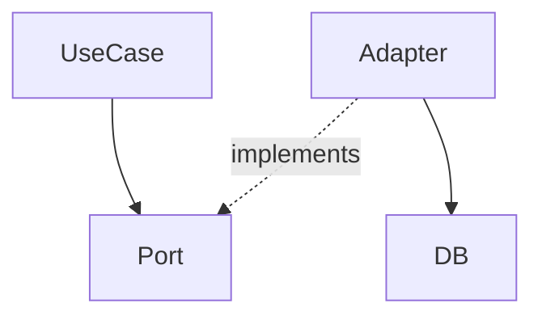

# Чтение и интерпретация архитектурных решений (v2)

## Порядок чтения architect_output.md

1. **Обзор решения** — понять намерение, не детали
2. **Диаграмма** — определить слои, направления зависимостей, границы модулей
3. **Типы и контракты** — священный контракт, не нарушать
4. **ENGINEER_TASKS** — найти свою `task_id`, прочитать `description` и `files_scope`
5. **Разделение труда → «Для инженера»** — только эта секция является зоной ответственности

## Работа с task_id в ENGINEER_TASKS

Каждый инженер работает только со своей `task_id`:

```yaml
- task_id: auth-hook
  description: Реализовать хук useAuth с логикой токена
  complexity: high
  dependencies: []
  files_scope:
    - src/hooks/useAuth.ts
    - src/services/authService.ts
```

- Работай **только с файлами из `files_scope`**
- Не выходи за пределы своей `task_id`
- Если нужны файлы вне `files_scope` — это повод для блокера

## Когда создавать блокер вместо кода

Создавай `engineer_tasks/<task_id>_blocker.md` вместо реализации если:

- **Тип/интерфейс не определён** в `architect_output.md` — не придумывай
- **Связь есть на диаграмме, но контракт не описан** — не угадывай сигнатуры
- **Архитектурное решение противоречит существующему коду** — не выбирай сторону
- **`files_scope` не соответствует описанию задачи** — scope-mismatch

## Интерпретация диаграмм

| Элемент | Значение |
|---------|----------|
| `A → B` (сплошная) | A зависит от B — прямая зависимость (импорт, инстанцирование) |
| `A -.-> B` (пунктирная) | Слабая связь — через интерфейс или событие |
| Граница/контур вокруг группы | Изолированный модуль; внутреннее не экспортируется наружу |
| `subgraph` | Слой или bounded context — общение только через публичный API |

### Пример: чтение зависимости



- `UseCase` импортирует интерфейс `Port` — **прямая зависимость**
- `Adapter` реализует `Port` — **инверсия зависимости** (Adapter знает о Port, UseCase не знает об Adapter)
- `Adapter → DB` — инфраструктурная деталь, скрытая от бизнес-логики

## Работа с зависимостями между task_id

Если твоя задача имеет `dependencies: [other-task-id]`:

1. Оркестратор гарантирует, что зависимая задача завершена до твоего запуска
2. Убедись, что контракт зависимой задачи (типы, интерфейсы, экспорты) описан в `architect_output.md`
3. Используй только публичный контракт зависимой задачи — не заглядывай в её внутреннюю реализацию
4. Если контракт зависимой задачи не описан в `architect_output.md` — создай блокер с типом `missing-contract`

```yaml
# Пример: задача зависит от другой
- task_id: order-form
  description: Форма создания заказа
  complexity: medium
  dependencies: [order-service]
  files_scope: [src/components/OrderForm.tsx]
```

В этом случае `order-form` импортирует типы/интерфейсы из `order-service`,
но НЕ его внутреннюю реализацию. Контракт должен быть описан архитектором.

## Соблюдение архитектурных границ

- Не импортируй напрямую то, что должно приходить через DI / props / контекст
- Не создавай зависимости, которых нет на диаграмме
- Если нужна новая зависимость — пометь `TODO: [architect]` и сообщи пользователю:

```typescript
// TODO: [architect] Нужна зависимость OrderService → NotificationPort
// Причина: требуется уведомление при смене статуса заказа
```

## Чеклист перед завершением

- [ ] Реализованы только задачи из своей `task_id` в `ENGINEER_TASKS`?
- [ ] Работа велась только с файлами из `files_scope`?
- [ ] Нет файлов вне `files_scope`?
- [ ] Типы и контракты из `architect_output.md` соблюдены точно?
- [ ] Нет зависимостей, которых нет на диаграмме?
- [ ] DI/props/контекст используется вместо прямых импортов где указано?
- [ ] Рутинные части помечены как `TODO: [developer]` с достаточным контекстом?
- [ ] Все неясности зафиксированы как `TODO: [architect]` или как блокер?
- [ ] При наличии `dependencies` — использован только публичный контракт зависимой задачи?
