# Архитектурные принципы и диаграммы

## SOLID

| Принцип | Суть | Применение |
|---------|------|------------|
| **S** — Single Responsibility | Один модуль/класс/компонент — одна причина для изменения | Если класс меняется по двум причинам — разделяй |
| **O** — Open/Closed | Открыт для расширения, закрыт для модификации | Новая логика — через новые сущности, не правку старых |
| **L** — Liskov Substitution | Подтип полностью заменяем базовым типом | Переопределение не должно ломать контракт родителя |
| **I** — Interface Segregation | Много специализированных интерфейсов лучше одного универсального | Клиент не должен зависеть от методов, которые не использует |
| **D** — Dependency Inversion | Модули верхнего уровня не зависят от нижнего; оба зависят от абстракций | Зависимость на интерфейс, не на реализацию |

## IoC и инверсия зависимостей

- **IoC (Inversion of Control)** — создание и жизненный цикл объектов передаётся контейнеру
- **DI (Dependency Injection)** — реализация IoC: зависимости передаются снаружи, не создаются внутри
- **Правило**: модуль объявляет интерфейс зависимости, контейнер/вызывающий код предоставляет реализацию

```typescript
// Правильно: зависимость через интерфейс
class OrderService {
  constructor(private repo: IOrderRepository) {}
}

// Неправильно: прямая зависимость на реализацию
class OrderService {
  private repo = new PostgresOrderRepository();
}
```

## Архитектурные правила

1. Каждый слой общается только с соседним слоем — не перепрыгивает
2. Бизнес-логика не зависит от UI и инфраструктуры (фреймворков, БД, HTTP)
3. Зависимости всегда направлены внутрь (к домену), никогда наружу
4. Если паттерн уже установлен в проекте — следуй ему; новый паттерн только с явным обоснованием

### Направление зависимостей


## Работа с диаграммами

### Чтение диаграмм

Принимай диаграммы в любом формате: PNG, SVG, Mermaid, PlantUML, draw.io XML, ASCII.

При анализе изображений (PNG/SVG) извлекай:
- Компоненты и их границы
- Связи и направления зависимостей
- Слои и группировки
- Протоколы взаимодействия (sync/async, HTTP/gRPC/events)

### Создание диаграмм

- Предпочтительный формат — **Mermaid** (если не указан другой)
- Диаграмма отражает **реальные** зависимости (проверяй по коду), а не желаемые
- Типы диаграмм по ситуации:

| Ситуация | Тип диаграммы |
|----------|---------------|
| Компоненты и зависимости | `graph TD` / `graph LR` |
| Поток данных / запроса | `sequenceDiagram` |
| Состояния объекта | `stateDiagram-v2` |
| Структура классов | `classDiagram` |
| Процесс деплоя / CI | `flowchart` |

### Пример: диаграмма компонентов

```mermaid
graph TD
  subgraph UI["Presentation Layer"]
    Page["Page Component"]
    Widget["Widget"]
  end

  subgraph App["Application Layer"]
    UseCase["Use Case"]
    Port["Port (interface)"]
  end

  subgraph Infra["Infrastructure"]
    Adapter["Adapter (impl)"]
    DB["Database"]
  end

  Page --> UseCase
  Widget --> UseCase
  UseCase --> Port
  Adapter -.->|implements| Port
  Adapter --> DB
```



## Чеклист при проектировании

- [ ] Зависимости направлены внутрь (к домену)?
- [ ] Бизнес-логика изолирована от инфраструктуры?
- [ ] Интерфейсы специализированы (ISP)?
- [ ] Новые компоненты расширяют систему, а не модифицируют существующие (OCP)?
- [ ] Решение вписывается в существующие паттерны проекта?
- [ ] Диаграмма соответствует реальному коду?
