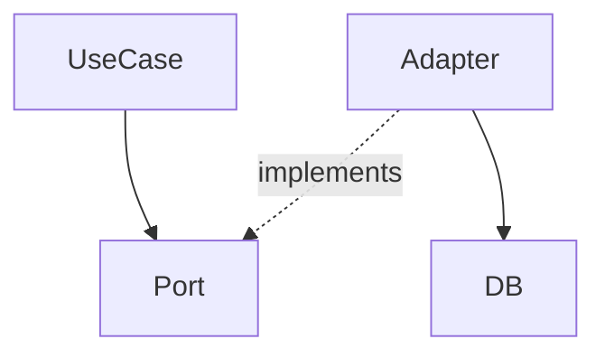

# Чтение и интерпретация архитектурных решений

## Порядок чтения architect_output.md

1. **Обзор решения** — понять намерение, не детали
2. **Диаграмма** — определить слои, направления зависимостей, границы модулей
3. **Типы и контракты** — священный контракт, не нарушать
4. **Разделение труда → «Для инженера»** — только эта секция является зоной ответственности

## Интерпретация диаграмм

| Элемент | Значение |
|---------|----------|
| `A → B` (сплошная) | A зависит от B — прямая зависимость (импорт, инстанцирование) |
| `A -.-> B` (пунктирная) | Слабая связь — через интерфейс или событие |
| Граница/контур вокруг группы | Изолированный модуль; внутреннее не экспортируется наружу |
| `subgraph` | Слой или bounded context — общение только через публичный API |

### Пример: чтение зависимости



- `UseCase` импортирует интерфейс `Port` — **прямая зависимость**
- `Adapter` реализует `Port` — **инверсия зависимости** (Adapter знает о Port, UseCase не знает об Adapter)
- `Adapter → DB` — инфраструктурная деталь, скрытая от бизнес-логики

## Стоп-правила: когда архитектура неясна

Остановись и уточни у пользователя, если:

- **Тип/интерфейс не определён** в architect_output.md — не придумывай
- **Связь есть на диаграмме, но контракт не описан** — не угадывай сигнатуры
- **Архитектурное решение противоречит существующему коду** — сообщи о конфликте, не выбирай сторону

## Соблюдение архитектурных границ

- Не импортируй напрямую то, что должно приходить через DI / props / контекст
- Не создавай зависимости, которых нет на диаграмме
- Если нужна новая зависимость — пометь `TODO: [architect]` и сообщи пользователю:

```typescript
// TODO: [architect] Нужна зависимость OrderService → NotificationPort
// Причина: требуется уведомление при смене статуса заказа
```

## Чеклист перед завершением

- [ ] Реализованы только задачи из секции «Для инженера»?
- [ ] Типы и контракты из architect_output.md соблюдены точно?
- [ ] Нет зависимостей, которых нет на диаграмме?
- [ ] DI/props/контекст используется вместо прямых импортов где указано?
- [ ] Рутинные части помечены как `TODO: [developer]` с достаточным контекстом?
- [ ] Все неясности зафиксированы как `TODO: [architect]` или запрошены у пользователя?
